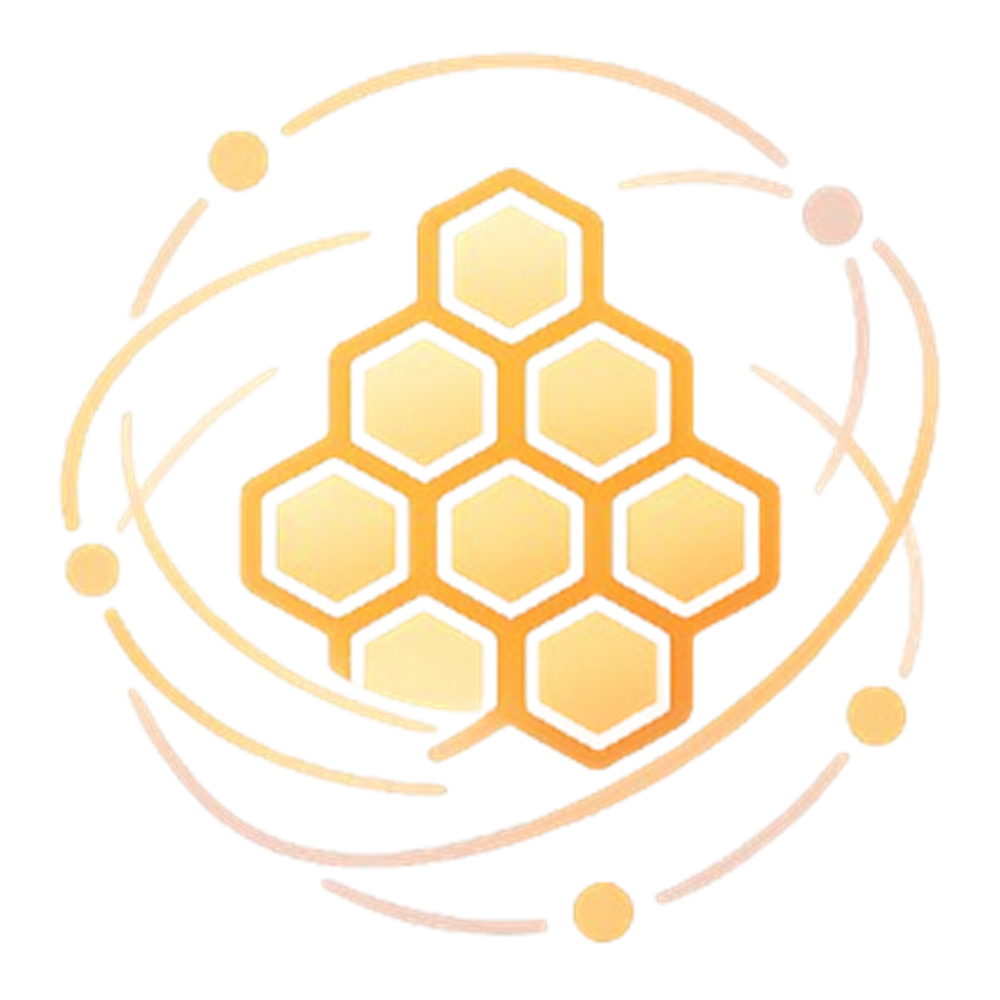

<div align="center">



# colmeia

**Orquestrador de agentes de IA em canvas infinito**

Cross-platform, sem marca-d'água e com aprovações de permissão centralizadas.

<br/>


</div>

---

## Visão geral

O **colmeia** é um orquestrador de agentes de IA sobre um canvas infinito, inspirado no
[Maestri](https://www.themaestri.app), porém cross-platform (Windows, macOS e Linux) e sem marca-d'água.

Cada agente — Claude Code, Codex, Ollama ou um shell — roda em um terminal real (PTY) que se torna um
nó arrastável no canvas. Os nós são conectados por linhas e os agentes se comunicam entre si por meio
de uma CLI própria. O desenvolvedor deixa de ser executor e passa a conduzir a equipe.

## Recursos

- **Terminais reais.** Cada nó é um PTY executando um shell ou uma CLI de agente, renderizado com xterm.js.
- **Comunicação entre agentes.** A CLI `colmeia`, disponível dentro de cada terminal, permite que um
  agente veja e envie mensagens aos agentes conectados a ele. As arestas do canvas definem a visibilidade.
- **Papéis.** Cada agente pode assumir um papel — Orquestrador, Arquiteto, Engenheiro, Revisor ou
  Testador. As instruções do papel são injetadas no agente e reforçadas a cada delegação.
- **Aprovações centralizadas.** Antes de executar um comando ou editar um arquivo, o agente pausa e a
  ação aparece em um painel central para aprovação ou recusa. Nada é aprovado automaticamente sem
  consentimento. Há também aprovação por sessão (por ferramenta e por agente) e auto-aprovação de
  escritas dentro da pasta de trabalho do agente.
- **Pasta de trabalho por nó.** Cada agente pode ser apontado para um diretório; agentes recrutados
  herdam a pasta de quem os recrutou, mantendo toda a equipe no mesmo projeto.
- **Floors.** Clones isolados via `git worktree`, permitindo que vários agentes trabalhem em paralelo
  sem conflito, com merge posterior dos branches.
- **Ombro.** Supervisor local (Ollama) que observa a saída recente dos agentes e sugere o próximo passo,
  executando inteiramente on-device.
- **Browser node.** Um nó de navegação embutido; o agente pode abrir uma página no canvas e receber o
  texto dela para leitura.
- **Rotinas.** Agendamento de comandos para execução periódica em um terminal.
- **Persistência.** O canvas é salvo e carregado automaticamente (layout, papéis, notas e pastas).
- **Temas e janela nativa.** Temas Midnight, Tokyo Night, Dracula e Rosé Pine, com janela sem moldura e
  barra de título própria.

## CLI `colmeia`

Disponível no `PATH` de cada terminal. Os comandos operam apenas sobre os nós conectados ao agente.

| Comando | Descrição |
|---|---|
| `colmeia list` | Lista os agentes conectados e seus papéis |
| `colmeia context` | Lê as notas de instrução conectadas ao agente |
| `colmeia check "<agente>"` | Lê a saída recente de outro terminal |
| `colmeia ask "<agente>" "<tarefa>"` | Delega uma tarefa a outro agente (com o papel dele no prefixo) |
| `colmeia recruit "<papel>"` | Cria um novo agente com o papel indicado, conectado ao recrutador |
| `colmeia dismiss "<título>"` | Remove um agente do canvas |
| `colmeia note "<título>" "<texto>"` | Cria uma nota no canvas |
| `colmeia connect "<a>" "<b>"` | Conecta dois nós |
| `colmeia browse "<url>"` | Abre uma página no canvas e retorna o texto dela |
| `colmeia routine create/list/delete` | Gerencia tarefas agendadas |

## Arquitetura

```
Terminal do agente ──(CLI colmeia)──► Servidor loopback (127.0.0.1, autenticado por token)
                                        |
   list / check / ask   → comunicação entre os agentes conectados
   context / note / ...  → emite eventos que mutam o canvas (React)
   approve               → pausa o agente e solicita decisão no painel central
   browse                → busca a página e devolve o texto ao agente
```

- Cada terminal é um PTY (`portable-pty`) no backend Rust; a saída é transmitida em base64 por um
  `Channel` do Tauri, evitando corromper UTF-8 entre chunks.
- A comunicação e as aprovações passam por um servidor HTTP restrito ao loopback, protegido por token
  de sessão e sem CORS. Páginas externas abertas no navegador não conseguem invocá-lo.
- As aprovações usam um hook `PreToolUse` do Claude Code que bloqueia a execução até a decisão do
  operador, garantindo controle humano sem desligar as permissões.

## Stack

| Camada | Tecnologia |
|---|---|
| Shell nativo e backend | Tauri 2 (Rust) |
| Gerenciador de pacotes e scripts | Bun |
| Interface | React 19 e TypeScript |
| Canvas | React Flow (`@xyflow/react`, MIT) |
| Terminal | xterm.js (UI) e portable-pty (backend) |

React Flow foi escolhido em vez de tldraw por ser MIT e sem marca-d'água, e porque seus nós são DOM
reais — o terminal xterm.js permanece interativo dentro deles.

## Execução

```bash
bun install
bun run tauri dev      # ambiente de desenvolvimento
bun run tauri build    # gera o instalável
```

Requisitos: Rust e o toolchain do Tauri (WebView2 no Windows) e Node.js (usado pela CLI `colmeia`).
Para cada agente, o respectivo CLI deve estar no `PATH` (`claude`, `codex`, `ollama`); o nó Shell
funciona sem dependências. O Ombro requer o Ollama em execução; os Floors requerem um repositório git.

## Roadmap

- [x] Terminais reais no canvas, comunicação entre agentes e papéis
- [x] Aprovações centralizadas (com auto-aprovação por sessão e por pasta)
- [x] Pasta de trabalho por nó, com herança no recrutamento
- [x] Floors (isolamento via `git worktree`)
- [x] Ombro (supervisor local via Ollama)
- [x] Browser node com leitura de página
- [x] Conexões tipadas (dados e controle) e desenho livre
- [x] Automação do browser (clicar e digitar) em páginas de mesma origem
- [ ] Automação de páginas cross-origin (requer um webview scriptável dedicado)

## Licença

Distribuído sob a **PolyForm Noncommercial License 1.0.0**: você pode usar,
estudar, modificar e compartilhar o colmeia para qualquer finalidade
**não-comercial**. **Uso comercial não é permitido** — não é possível vender o
software nem usá-lo para prover um produto ou serviço pago — sem uma licença
comercial separada do autor. Veja [LICENSE.md](LICENSE.md).
